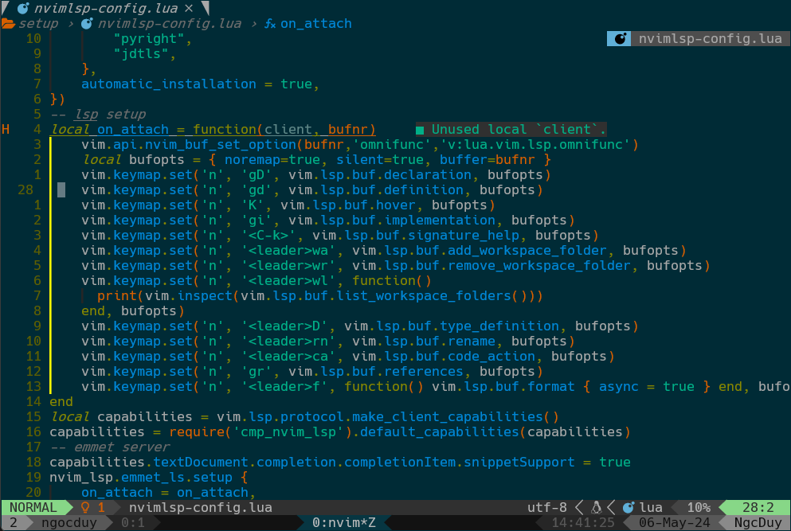

# Content

- Neovim Config
- Fish Config
- Tmux Config

---

## Neovim Config



1. neovim manager : PACKER

> Unix, Linux Installation

```
git clone --depth 1 https://github.com/wbthomason/packer.nvim\
 ~/.local/share/nvim/site/pack/packer/start/packer.nvim
```

> Windows Powershell Installation

```
git clone https://github.com/wbthomason/packer.nvim "$env:LOCALAPPDATA\nvim-data\site\pack\packer\start\packer.nvim"
```

2. before install plugin , just install somthing need for config neovim

- git

```
brew install git
```

- curl

```
sudo apt install curl
```

- nodejs

```
brew install nodejs

npm install neovim -g
```

- python

```
brew install python@3.11

pip3.11 install pynvim
```

- GCC , make

```
sudo apt install gcc

brew install make
```

- fzf , ripgrep , fd , bat for search

```
brew install fzf

brew install fd

brew install ripgrep

brew install bat
```

3. build with that tree folder

```
📂 ~/.config/nvim
├── 📂 lua
│  └──  📁 base
|  |    └──🌑 core.lua
|  └── 📁  setup
|  |   └── plugin-config.lua
|  └── plugins.lua
└── 🇻 init.lua
```

```
vim.cmd [[packadd packer.nvim]]

return require("packer").startup(function(use)
    --packer
    use 'wbthomason/packer.nvim'

    --colorscheme
    use "craftzdog/solarized-osaka.nvim"
    -- use 'navarasu/onedark.nvim'

    use 'nvim-tree/nvim-web-devicons'

    --plenary
    use { 'nvim-lua/plenary.nvim' }

    --tmux
    use "christoomey/vim-tmux-navigator"

    --window
    use({'mrjones2014/smart-splits.nvim',tag='v1.0.0'})
    --incline
    use "b0o/incline.nvim"
    -- move vim
    use 'fedepujol/move.nvim'
    -- comment
    use {
        'numToStr/Comment.nvim',
        config = function()
            require('Comment').setup()
        end
    }
    --indent
    use "lukas-reineke/indent-blankline.nvim"
    --rename
    use {
        "smjonas/inc-rename.nvim",
        config = function()
            require("inc_rename").setup()
        end,
    }


    -- lualine
    use {
        'nvim-lualine/lualine.nvim',
        require = { 'nvim-tree/nvim-web-devicons', opt = true }
    }


    -- buffer
    use { 'akinsho/bufferline.nvim', tag = "*" }


    -- treesitter
    use {
        'nvim-treesitter/nvim-treesitter',
        run = function()
            local ts_update = require('nvim-treesitter.install').update({ with_sync = true })
            ts_update()
        end,
    }


    -- telescope
    use {'nvim-telescope/telescope.nvim', tag = '0.1.4',}
    use {'nvim-telescope/telescope-file-browser.nvim',
        require = {
            "nvim-telescope/telescope.nvim",
            "nvim-lua/plenary.nvim",
        }
    }
    use { 'nvim-telescope/telescope-fzf-native.nvim', run = 'make' }


    -- auto tag
    use "windwp/nvim-autopairs"
    use "windwp/nvim-ts-autotag"


    -- lsp,mason,mason-lspconfig
    use 'neovim/nvim-lspconfig'
    use 'williamboman/mason.nvim'
    use 'williamboman/mason-lspconfig.nvim'
    use 'NvChad/nvim-colorizer.lua'


    -- cmp , lspkind
    use 'hrsh7th/nvim-cmp'
    use 'hrsh7th/cmp-nvim-lsp'
    use 'hrsh7th/cmp-buffer'
    use 'hrsh7th/cmp-path'
    use 'hrsh7th/cmp-cmdline'
    use 'hrsh7th/cmp-emoji'
    use({
        "L3MON4D3/LuaSnip",
        -- follow latest release.
        tag = "v2.*", -- Replace <CurrentMajor> by the latest released major (first number of latest release)
        -- install jsregexp (optional!:).
        run = "make install_jsregexp"
    })
    use 'saadparwaiz1/cmp_luasnip'
    use 'mtoohey31/cmp-fish'
    use 'onsails/lspkind.nvim'

    --lsp saga
    use ({
        'nvimdev/lspsaga.nvim',
        after = 'nvim-lspconfig',
        config = function()
            require('lspsaga').setup({})
        end,
    })

    --null-lsp , pretitier
    use 'nvimtools/none-ls.nvim'
    use 'MunifTanjim/prettier.nvim'

    --markdown-preview
    use({ "iamcco/markdown-preview.nvim", run = "cd app && npm install", setup = function() vim.g.mkdp_filetypes = { "markdown" } end, ft = { "markdown" }, })

    -- use 'MunifTanjim/eslint.nvim'
    -- use "folke/noice.nvim"
    -- use 'MunifTanjim/nui.nvim'
    -- use 'rcarriga/nvim-notify'
end)

```

---

## Fish shell config

1. fish shell

```
brew install fish
```

add fish shell default shell

```
sudo echo $(which fish) >> /etc/shells

chsh -s $(which fish)
```

1. fish manager

```
curl -sL https://raw.githubusercontent.com/jorgebucaran/fisher/main/functions/fisher.fish | source && fisher install jorgebucaran/fisher
```

you can add plugin or remove by that cmd :

```
add : fisher install (path plugin)

remove : fisher remove (path plugin)
```

2. theme

```
fisher install IlanCosman/tide@v5
```

3. Z

```
fisher install jethrokuan/z
```

4. eza icon for fish

```
brew install eza
```

5. fzf

```
fisher install PatrickF1/fzf.fish
```

---

## Tmux config

1. tmux manager

```
git clone https://github.com/tmux-plugins/tpm ~/.tmux/plugins/tpm
```

2. config

```
set -g @plugin 'tmux-plugins/tpm'

set -g @plugin 'christoomey/vim-tmux-navigator' # neovim with tmux
set -g @plugin 'jimeh/tmux-themepack' #plugin manager theme for tmux
set -g @themepack 'powerline/default/gray' # use this theme for tmux

set -g @resurrect-capture-pane-contents 'on' # allow tmux-ressurect to capture pane contents
set -g @continuum-restore 'on' # enable tmux-continuum functionality

run '~/.tmux/plugins/tpm/tpm'
```
